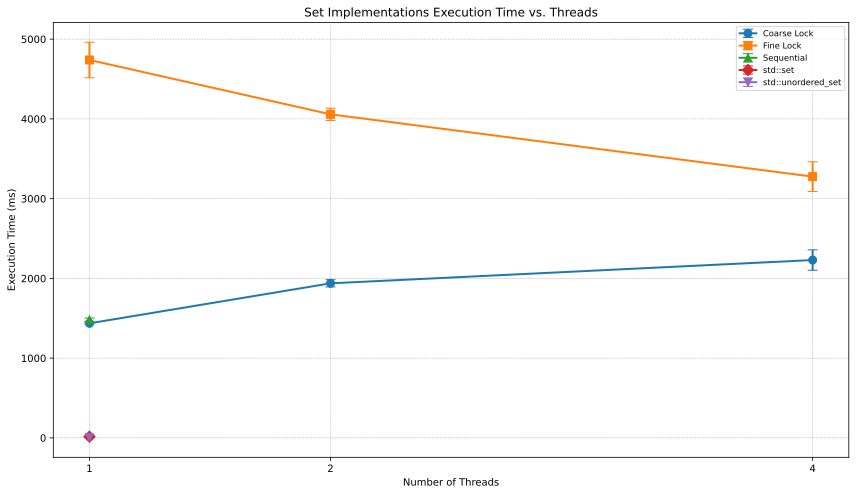

# Part 2: Concurrent Data Structures

## 1. Introduction

Parallel algorithms often require data structures that can be safely and
efficiently accessed by multiple threads concurrently. This section details the
design, implementation, testing, and evaluation of two fundamental concurrent
data structures developed for this project: a concurrent Set based on a sorted
linked list and a concurrent Priority Queue, also based on a sorted linked
list.

The primary goal for the concurrent Set was to explore different locking
strategies as required by the assignment, specifically coarse-grained and
fine-grained locking. The concurrent Priority Queue was developed to serve as
the core enabling component for the parallel A* algorithm implementation
discussed in Part 3 of this report. Both structures were rigorously tested for
correctness and their performance characteristics were evaluated through
benchmarking.

## 2. Concurrent Set (Sorted Linked List)

### 2.1. Overview and Requirements

The Set data structure provides standard operations: adding an element,
removing an element, and checking for the presence of an element, while
ensuring no duplicate elements are stored. For concurrent access, these
operations must be thread-safe. The assignment required the implementation of
two distinct concurrent variants based on a sorted linked list representation.
We chose to implement coarse-grained and fine-grained locking strategies.

### 2.2. Implementation Variants

Both variants utilize a sorted linked list structure with head and tail
sentinel nodes containing the minimum and maximum possible values for the
element type, respectively. This simplifies boundary conditions during list
traversal and modification.

#### 2.2.1. Coarse-Grained Locking (`SortedLinkedList_CoarseLock`)

* **Design:** This variant employs a single `std::shared_mutex` that protects
the entire list. Write operations (add, remove) acquire an exclusive lock
(`std::unique_lock`), while read operations (contains, check_invariants)
acquire a shared lock (`std::shared_lock`).
* **Implementation:** Each method call first acquires the appropriate lock for
the duration of the operation, ensuring mutual exclusion for writes and
allowing concurrent reads. An atomic counter (`std::atomic<size_t>`) is used
for efficient and thread-safe size tracking.

#### 2.2.2. Fine-Grained Locking (`SortedLinkedList_FineLock`)

* **Design:** This variant associates a `std::mutex` with each node in the
list. Operations lock only the specific nodes involved, aiming to increase
potential concurrency compared to the coarse-grained approach.
* **Implementation:** A hand-over-hand (or lock-coupling) technique is used for
traversal and modification. To perform an operation on a node or insert/delete
between two nodes, the predecessor and current nodes are locked. The lock on
the predecessor is released only after the lock on the current node's successor
is acquired, ensuring a chain of locked nodes prevents race conditions during
traversal. An atomic counter is also used for size tracking.

### 2.3. Correctness Testing

#### 2.3.1. Testing Strategy

A comprehensive testing strategy was employed using the GoogleTest framework,
integrated via CMake/CTest. Correctness was verified through multiple
approaches:

* **Sequential Logic Tests (`tests/set_sequential_test.cpp`):** Verified the
fundamental logic (add, remove, contains, size, sorted order) of the underlying
sorted list implementation in a single-threaded environment. These tests were
applied to both concurrent variants to ensure baseline correctness.
* **Concurrent Behavior Tests (`tests/set_concurrent_test.cpp`):** Focused on
verifying thread safety and correct behavior under concurrent access patterns.
Most concurrent tests started with an empty Set to evaluate behavior during
initial concurrent modifications.
* **Sanitizers:** Crucially, tests were executed using different CMake presets
(`CMakePresets.json`) configured to enable compiler sanitizers:
  * **ThreadSanitizer (TSan):** Used during concurrent tests (`debug-tsan`,
    `debug-tsan-clang` presets) to detect data races and other thread-related
    errors.
  * **AddressSanitizer (ASan) & UndefinedBehaviorSanitizer (UBSan):** Used
    primarily during sequential logic tests (`debug-asan`, `debug-asan-clang`
    presets) to detect memory errors (e.g., leaks, use-after-free) and
    undefined behavior, ensuring fundamental memory safety.
* **Invariant Checks:** A `check_invariants()` method was implemented in each
Set variant to verify internal consistency (e.g., sorted order, pointer
integrity). These checks were asserted at the end of concurrent tests (run
after all threads joined) to confirm the final state was valid. Note: The
`check_invariants` method itself is not thread-safe and assumes exclusive
access or a quiescent state.

*(Note: Warmup phases, while present in the performance benchmarks, were not
explicitly used within the correctness test logic itself.)*

#### 2.3.2. Key Test Cases

* **Sequential:** Basic add/remove/contains, handling duplicates, edge cases
(empty list, removing non-existent elements), large dataset operations.
* **Concurrent:**
  * `ConcurrentAdds`: Multiple threads add unique, non-overlapping sets of
    values concurrently to an initially empty set. Verifies that all adds
    succeed and the final set contains all expected elements.
  * `ConcurrentMixedOpsInvariantCheck`: Multiple threads perform a random mix
    of add, remove, and contains operations on an initially empty set. Verifies
    that the internal list invariants hold after concurrent execution.
  * `StressTestDuration`: Multiple threads execute a high volume of mixed
    operations on an initially empty set for a fixed duration (10 seconds) to
    detect deadlocks, race conditions, or crashes under sustained load.
    Invariant checks are performed post-test.

#### 2.3.3. Results

All sequential and concurrent tests passed successfully for both the
`SortedLinkedList_CoarseLock` and `SortedLinkedList_FineLock` implementations
across different build configurations, including those utilizing TSan, ASan,
and UBSan. The stress tests completed without deadlocks or crashes, and
internal invariants were maintained, indicating the robustness of the locking
mechanisms and the absence of detected data races or memory errors under the
tested conditions.

### 2.4. Performance Evaluation

#### 2.4.1. Benchmarking Setup

Performance was evaluated using the Google Benchmark framework
(`benchmarks/set_benchmark.cpp`). The benchmark scenario involved a workload
consisting of a mix of 40% add, 40% remove, and 20% contains operations over a
predefined integer range. Benchmarks included a warmup phase before
measurements began. The performance of the coarse-grained and fine-grained
implementations was measured and compared against the sequential linked list
implementation and the standard library's `std::set` and `std::unordered_set`
(as single-threaded baselines). Benchmarks were run with varying numbers of
threads (1 up to the number of hardware threads available). Results were
recorded in `benchmarks/benchmark_results/set_benchmarks_result.json`.

#### 2.4.2. Results and Analysis

**Benchmark Execution Time Summary (set_benchmarks_result.json)**

| Implementation        | 1 Thread            | 2 Threads           | 4 Threads           |
|-----------------------|---------------------|---------------------|---------------------|
| Coarse Lock           | 1436.64 ± 8.33 ms   | 1938.25 ± 45.37 ms  | 2230.05 ± 128.19 ms |
| Fine Lock             | 4738.73 ± 222.83 ms | 4057.26 ± 76.14 ms  | 3275.90 ± 186.85 ms |
| Sequential            | 1482.41 ± 20.71 ms  | N/A                 | N/A                 |
| std::set              | 15.04 ± 1.12 ms     | N/A                 | N/A                 |
| std::unordered_set    | 4.27 ± 0.25 ms      | N/A                 | N/A                 |

* **Analysis:** The benchmark results reveal several key points regarding the
Set implementations:
  * **Overhead of Locking:** Both concurrent implementations exhibit
    significantly higher execution times compared to the non-thread-safe
    standard library `std::set` and especially `std::unordered_set` (which is
    roughly 300-1000x faster in the single-threaded case). This highlights the
    substantial overhead introduced by mutex locking and atomic operations
    required for thread safety.
  * **Coarse vs. Fine (1 Thread):** Contrary to the expectation that
    fine-grained locking might have slightly more overhead, the `Fine Lock`
    implementation was considerably slower (~3.3x) than the `Coarse Lock`
    implementation with a single thread. The `Coarse Lock` time was comparable
    to the `Sequential` version, suggesting minimal lock contention overhead
    with one thread. The `Fine Lock` overhead likely stems from the more
    complex hand-over-hand locking logic and potentially more frequent atomic
    size updates during traversal steps.
  * **Scalability:**
    * The `Coarse Lock` implementation demonstrates poor scalability. Its
        execution time increases by ~35% when moving from 1 to 2 threads and
        further increases by ~15% from 2 to 4 threads. This aligns with
        expectations, as the single global lock becomes a major point of
        contention, serializing access as more threads compete for it.
    * The `Fine Lock` implementation, despite its higher single-thread
        cost, shows positive scalability. Execution time *decreases* by ~14%
        from 1 to 2 threads and by another ~19% from 2 to 4 threads. This
        indicates that allowing concurrent operations on different parts of the
        list outweighs the individual lock overhead as parallelism increases.
        Notably, at 4 threads, the `Fine Lock` version becomes faster than the
        `Coarse Lock` version.
  * **Conclusion:** While the standard library sets offer superior
    single-threaded performance, they are not thread-safe. Between the
    concurrent implementations, `Coarse Lock` is simpler and faster for
    single-threaded or low-contention scenarios, but `Fine Lock` provides
    significantly better scalability for higher thread counts, becoming the
    preferred choice when contention is expected, despite its higher base
    overhead.

## 3. Concurrent Priority Queue (Sorted Linked List)

### 3.1. Motivation and Requirements

The parallelization of the A*algorithm requires a thread-safe data structure
to manage the "open set" of nodes to be explored. This structure must function
as a priority queue, allowing concurrent threads to efficiently push new nodes
and pop the node with the highest priority (lowest f-score in A*). Key
requirements include:

* `push(T val)`: Insert an element according to its priority.
* `pop()`: Remove and return the element with the highest priority.
* `empty()`/`size()`: Check state and size.
* Priority Ordering: Elements must be retrieved in order of priority.
* FIFO for Equal Priorities: Elements with the same priority should be
retrieved in the order they were inserted.

### 3.2. Implementation (`SortedLinkedList_FineLockPQ`)

A concurrent priority queue was implemented using a sorted linked list with
fine-grained locking, similar to the fine-grained Set.

* **Design:** The list stores elements sorted by priority (using a template
parameter `Compare` for flexibility). Sentinel nodes represent the lowest and
highest possible priorities. Each node contains a `std::mutex`. The highest
priority element is maintained at one end of the list (specifically, the node
just before the tail sentinel) for efficient `pop` operations.
* **Implementation:** `push` uses hand-over-hand locking to find the correct
sorted position based on priority and inserts the new node. `pop` locks the
predecessor of the highest-priority node (the node before the tail sentinel),
the highest-priority node itself, and the tail sentinel, then unlinks the
highest-priority node and returns its value. `std::atomic<size_t>` tracks the
size. The implementation requires the element type `T` to have
`std::numeric_limits` specialized for sentinel value generation.

### 3.3. Correctness Testing

#### 3.3.1. Testing Strategy

Correctness was verified using GoogleTest, integrated via CMake/CTest,
employing a multi-faceted approach:

* **Sequential Logic Tests (`tests/pq_sequential_test.cpp`):** Validated core
priority queue logic in a single thread: correct priority ordering on `pop`,
FIFO behavior for elements with equal priority, handling of empty queue, basic
`push`/`pop` sequences.
* **Concurrent Behavior Tests (`tests/pq_concurrent_test.cpp`):** Assessed
thread safety under various concurrent scenarios. Some tests (`ConcurrentPop`,
`ConcurrentMixedOpsInvariantCheck`) involved pre-populating the queue to ensure
`pop` operations had elements to target initially, while others
(`ConcurrentPush`, `StressTestDuration`) started with an empty queue.
* **Sanitizers:** Similar to the Set testing, CMake presets were used to run
tests with sanitizers enabled:
  * **ThreadSanitizer (TSan):** Used during concurrent tests to detect data
    races.
  * **AddressSanitizer (ASan) & UndefinedBehaviorSanitizer (UBSan):** Used
    during sequential tests to detect memory errors and undefined behavior.
* **Invariant Checks:** A `check_invariants()` method verified internal list
consistency (sorted order by priority) after concurrent operations completed.
This check assumes exclusive access post-test.

*(Note: Warmup phases, while present in the performance benchmarks, were not
explicitly used within the correctness test logic itself.)*

#### 3.3.2. Key Test Cases

* **Sequential:** Priority order verification, FIFO verification with equal
priorities, interleaved push/pop, large dataset correctness.
* **Concurrent:**
  * `ConcurrentPush`: Multiple threads push unique items concurrently to an
    initially empty queue.
  * `ConcurrentPop`: Multiple threads pop items concurrently from a
    pre-filled queue until empty.
  * `ConcurrentMixedOpsInvariantCheck`: Multiple threads perform a random mix
    of push and pop operations on a slightly pre-filled queue. Verifies
    invariants post-execution.
  * `StressTestDuration`: Multiple threads execute a high volume of mixed
    push/pop operations on an initially empty queue for a fixed duration (10
    seconds). Checks for deadlocks/crashes and verifies invariants post-test.

#### 3.3.3. Results

The `SortedLinkedList_FineLockPQ` implementation passed all sequential and
concurrent test cases, including runs with TSan, ASan, and UBSan enabled.
Priority and FIFO ordering were maintained correctly under sequential
execution. Concurrent tests, including the stress test, completed without
deadlocks or crashes, and post-test invariant checks passed, indicating the
locking mechanism effectively prevented data races and maintained structural
integrity under the tested concurrent workloads.

### 3.4. Performance Evaluation

#### 3.4.1. Benchmarking Setup

Performance was measured using Google Benchmark
(`benchmarks/pq_benchmark.cpp`). The workload involved a 50%/50% mix of `push`
and `pop` operations over a defined priority range. Benchmarks included a
warmup phase before measurements. The benchmark measured the performance of the
`SortedLinkedList_FineLockPQ` with varying thread counts and compared it
against the single-threaded performance of `std::priority_queue` (from the C++
standard library) as a baseline. Results were recorded in
`benchmarks/benchmark_results/pq_benchmarks_result.json`.

#### 3.4.2. Results and Analysis

**Benchmark Execution Time Summary (pq_benchmarks_result.json)**

| Implementation        | 1 Thread           | 2 Threads          | 4 Threads          |
|-----------------------|--------------------|--------------------|--------------------|
| Fine Lock PQ          | 50.89 ± 0.40 ms    | 58.74 ± 0.45 ms    | 43.79 ± 8.44 ms    |
| std::priority_queue   | 3.03 ± 0.08 ms     | N/A                | N/A                |

* **Analysis:** The performance results for the Priority Queue show:
  * **Overhead vs. Baseline:** The `Fine Lock PQ` is significantly slower
    (~17x) than the standard, non-thread-safe `std::priority_queue` in the
    single-threaded case. This large difference underscores the performance
    cost associated with the fine-grained locking mechanism (hand-over-hand
    traversal, per-node mutexes) compared to the optimized heap structure
    typically used by `std::priority_queue`.
  * **Scalability:** The scalability behavior is interesting. Moving from 1
    to 2 threads results in a slight performance degradation (~15% increase in
    time), suggesting that for this specific workload and hardware (4 CPUs
    reported in context), the overhead of coordination and potential contention
    slightly outweighs the benefits of parallelism with only two threads.
    However, when scaling further to 4 threads, the execution time drops
    significantly, becoming \~14% faster than the single-threaded `Fine Lock PQ`
    run and \~25% faster than the 2-thread run. This indicates that with
    sufficient available cores (matching the 4 threads used), the fine-grained
    locking allows enough concurrent operations to overcome its overhead and
    achieve positive scaling.
  * **Conclusion:** While much slower than the non-thread-safe baseline, the
    `Fine Lock PQ` demonstrates the potential for performance improvement
    through parallelism on multi-core systems, particularly as the number of
    threads approaches the number of available cores. The initial slowdown at 2
    threads suggests a threshold where parallelism benefits begin to manifest
    for this implementation and workload.

## 4. Conclusion

This section detailed the implementation of concurrent Set and Priority Queue
data structures based on sorted linked lists with different locking strategies.
Two Set variants (coarse-grained and fine-grained locking) and one fine-grained
locking Priority Queue were developed. Rigorous testing, including the use of
TSan, ASan, and UBSan, confirmed their correctness under both sequential and
concurrent workloads. Performance benchmarks indicated the expected trade-offs
and some interesting scaling behaviors: fine-grained locking offered better
scalability than coarse-grained locking for the Set at higher thread counts,
while the concurrent Priority Queue showed good scaling at 4 threads despite
significant single-thread overhead compared to its non-thread-safe counterpart.
These data structures, particularly the concurrent Priority Queue, form the
foundation for the parallel A* implementation presented in the subsequent
section.
